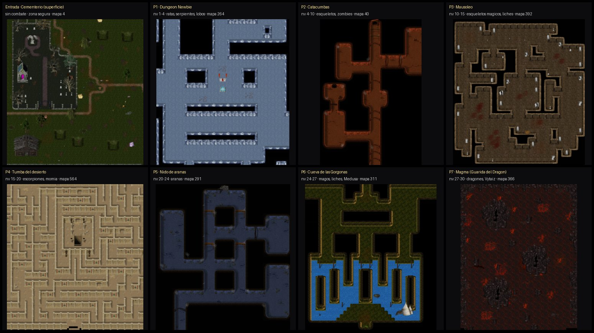
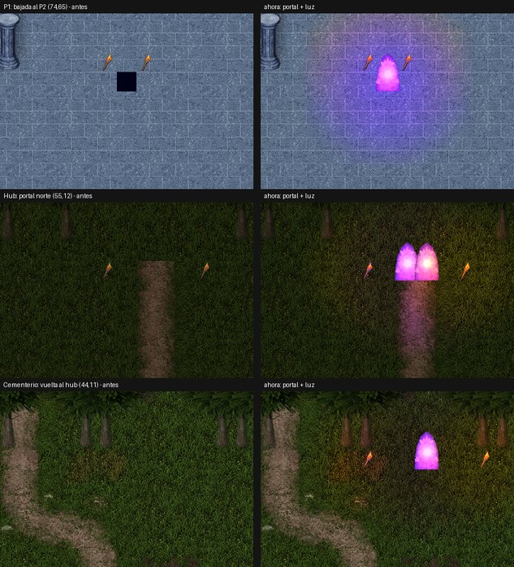
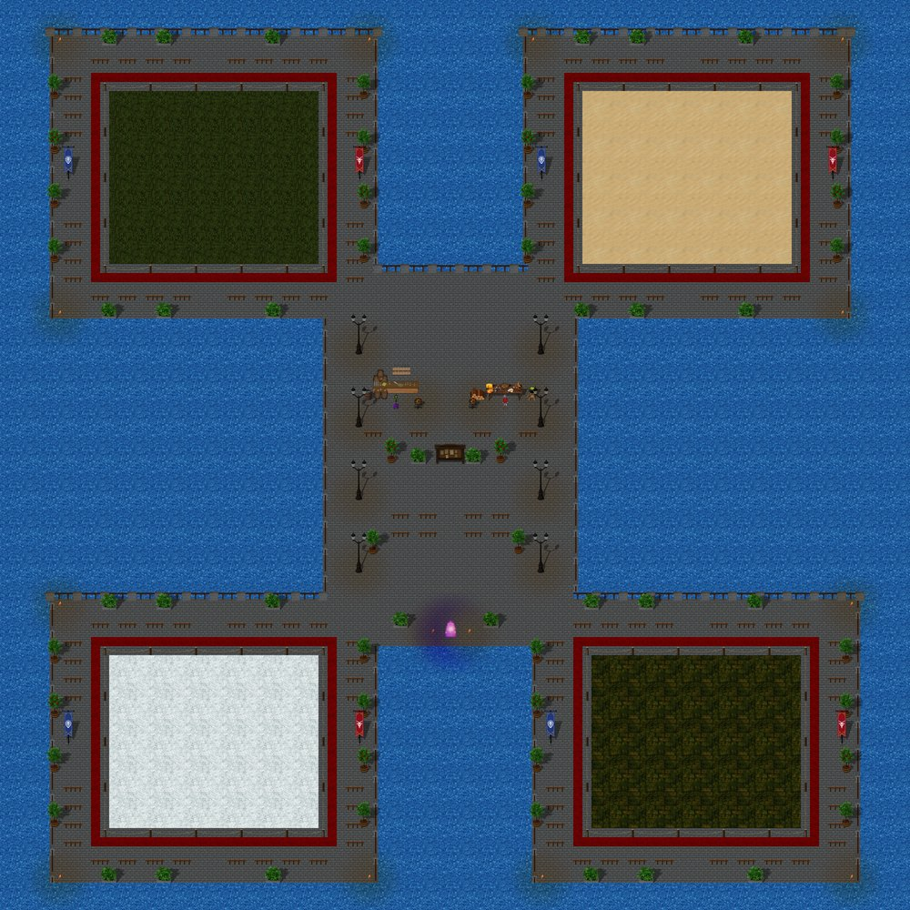
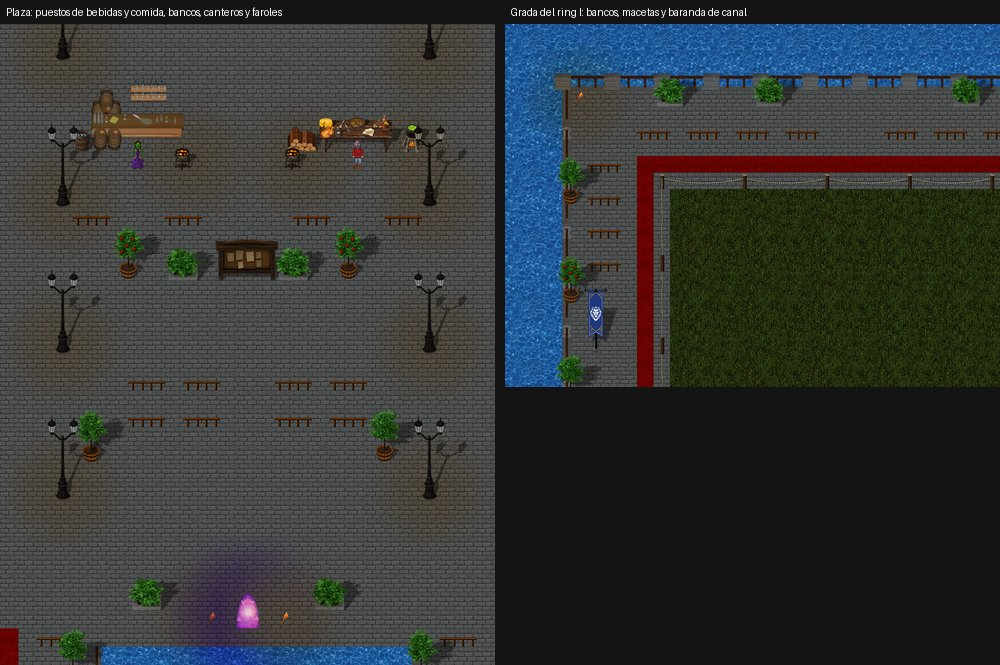

# Mapa de la demo: reglas y recorrido (nube, 25/09)

**Estado (25/09, tarde): APLICADO en la rama de la nube** `claude/nifty-thompson-r3ulpf`, sobre el trabajo de la PC (`pc/demo-mapas`, commit edcd99d5).
- Lucas aprobó las reglas el 25/09. Se cambiaron los datos del dungeon, las especificaciones y el generador de arte; se regeneraron los mapas 1000 y 1010–1017, el catálogo del servidor, la música, la luz y los minimapas.
- **No cambia ningún NPC**: los mismos NPC, las mismas cantidades, stats, EXP, oro, drops y respawn. Solo cambian el mapa fuente, las posiciones de los grupos, las escaleras, los nombres y la luz.
- Verificado en la nube: `demo_map_builder.py` sin fallas y `--check` igual; `ci_checks.py`; build del servidor; `test_coop_server`, `test_static_npcs`, `test_duel_server`, `test_server_robustness`, `test_npc_vision` y `test_death_drop` pasan. **Falta probarlo en Unity.**
- Antes y después: `antes_despues.jpg`.

## Reglas aprobadas
**Recorrido**
1. **Hub (1000):** se aparece en el centro, en zona segura. **Arenas al norte y Dungeon al sur**, cada salida con su cartel.
   - Esto resuelve la contradicción entre `arquitectura.md` (norte) y `arte.md` (este).
2. **Toda salida tiene vuelta.** Cada piso tiene un **atajo al hub** en su entrada (portal o cartel).

**Dungeon con lógica**

3. **Siempre bajando:** superficie → subsuelo → profundidades. Nada de aire libre ni torres a mitad de camino.
4. **Cada piso con un set visual distinto.**
5. **Estructura de cada piso:** entrada segura de 8 casillas sin NPC → salas con grupos → escalera de bajada al fondo, lejos de la entrada.
6. **Sala del jefe** de 12×12, sin obstáculos grandes adentro.

**Coherencia visual**

7. Solo gráficos originales y **decoración acorde**: nada de árboles en cuevas, lava solo en el volcánico, agua solo donde tenga sentido.
8. **Luz según la profundidad:** la superficie más clara y abajo cada vez más oscuro, con antorchas en los caminos.

**Arenas**

9. **4 rings alrededor de una plaza**, con gradas. Los rings están cerrados: se entra por teletransporte.
10. **Cada ring con su tema** (bosque, desierto, nieve, mazmorra) y el nombre en un cartel.

**Límites**

11. **No se tocan** stats, EXP ni drops: solo el mapa, las posiciones y la cantidad de NPC.
12. **Mapas de 100×100 como máximo;** pisos de ~70×70. Un mapa original entero puede usarse si entra en 100×100.

## Recorrido del dungeon (cómo se aplica la regla 3)
Primero se propuso reordenar solo los gráficos. Así, las arañas quedaban en una cripta y los liches en una cueva.

**Ajuste:** cada tramo de nivel conserva sus NPC (`dungeon-npcs.json`, sin cambios) y va al mapa original **donde esos NPC viven en el AO**. El orden siempre baja y cada piso tiene un set distinto.

| Mapa demo | Piso | Nivel | NPC (sin cambios) | Mapa fuente | Cómo quedó |
|---|---|---|---|---|---|
| 1010 | **Entrada: Cementerio de Nix** (superficie) | — | ninguno (zona segura) | 4 | Se llega del hub por el camino norte (44–48, 11), que también es la vuelta. La **puerta de la capilla** (20–21, 43) baja al P1, como en el original. Las lápidas originales se pueden leer. |
| 1011 | **P1 Dungeon Newbie** | 1–4 | ratas, murciélagos, serpientes, escorpiones, lobos, Wolfang | 264 entero | Sin muros cortados. Mismas zonas y escaleras. |
| 1012 | **P2 Catacumbas** | 4–10 | esqueletos, zombies, Humano No-Muerto | 40 | Se entra arriba (46,13) y la bajada está al fondo del pasillo central (46,90). Grupos en la sala oeste, la sala este (2), el pasillo y la sala del medio. El jefe está en la sala oeste grande (22,76), fuera del camino a la bajada. La cripta con la puerta "cerrada con llave" queda cerrada, como en el original. |
| 1013 | **P3 Mausoleo** | 10–15 | esqueletos mágicos, liches menores, Guardián | 392 entero | Sin cortes. Mismas zonas y escaleras. |
| 1014 | **P4 Tumba del desierto** | 15–20 | escorpiones, escarabajos, Momia | 564 entera | Se entra por la **puerta real de la pirámide** (49,88). Los grupos van en el orden del camino: 60, 100, 140 y 180 casillas. La **Momia está en la cámara funeraria** con estatuas (49,34). La bajada está en el rincón noroeste (26,14), fuera de la cámara. |
| 1015 | **P5 Nido de arañas** | 20–24 | arañas, Mutante Arácnido | 291 entero | Sin cortes. Mismas zonas y escaleras. |
| 1016 | **P6 Cueva de las Gorgonas** | 24–27 | liches, magos malvados, orco brujo, Medusa | 311 | Circuito alrededor del bloque central: se entra por el oeste (14,13) y se baja por el noreste (87,13). La **Medusa está en la orilla del lago** (49,50). La isla del sur se ve pero no tiene paso. |
| 1017 | **P7 Guarida del Dragón (Magma)** | 27–30 | dragones chicos, Vytaiz | 366 | Se entra por el sur (50,89). Hay 4 grupos entre islas de roca y lava. **Vytaiz está en la cámara norte** (48,17). El portal al hub queda en el noreste (76,17). |

**Descartados:** Dungeon Veriil (140–142), Dungeon Dragon (391, 377) y Limbo (314).
- Tienen el mismo piso de musgo que la Cueva de las Gorgonas: por eso P6 y P7 se veían iguales.
- 391 y 377 son salas vacías.

## Luz (regla 8)
`baseLight` en RGB, de más clara a más oscura:

| Mapa | Luz |
|---|---|
| Entrada | B4BED2, noche con luna |
| P1 | A0A0A0 |
| P2 | 949494 |
| P3 | 8080AA, la luz propia del Mausoleo |
| P4 | 8C8274 |
| P5 | 767C84 |
| P6 | 646E82 |
| P7 | 7E5040, roja por la lava |

Queda en `map_environment.json` y en `textos-hub.md` §6.

## Salidas: portal con luz (pedido de Lucas, 25/09 tarde)
Ninguna salida es un punto negro. Antes las 14 escaleras de los pisos eran el hueco negro 57950 y ninguna salida tenía luz.
- **Portal:** toda salida usa el teleport original 49488, el portal violeta animado de 8 cuadros. Va en la capa 3 y se puede pisar.
- **Luz:**
  - halo violeta `B47CFF` de radio 4 sobre el portal;
  - antorchas a los costados con luz cálida `FFB45A` de radio 3;
  - frente a las puertas, luz cálida de radio 4.
- **Dónde:**
  - hub: portal doble al norte, en el camino a las arenas, y la puerta del dungeon iluminada;
  - arenas: la vuelta al hub;
  - cementerio: la vuelta al hub, en el camino norte, y la puerta de la capilla;
  - pisos P1–P7: todas las bajadas y los atajos al hub, incluido el portal del P7.
- **Luces del motor:** las luces usan `range` 100 o más, que es un halo redondo que se apaga hacia el borde (radio = `range` − 99). Con menos de 100, `AOMapLighting` pinta un cuadrado de color plano.
- El catálogo del servidor no cambia, porque las luces y los gráficos no van en él.

## Hub y arenas (reglas 1, 9 y 10)
- En el hub, las Arenas quedan al norte y el Dungeon al sur. Solo cambia la llegada al 1010.
- En las arenas hay 4 rings con tema (bosque, desierto, nieve y mazmorra), una plaza central y carteles "Arena I–IV".

### Arena más viva (pedido de Lucas, 25/09 tarde)
La plaza y las gradas estaban vacías. Ahora todo el decorado sale de **Banderbill**, la ciudad original que usa este mismo empedrado (58114), para que combine. No se usa nada de otro estilo.
- **Gradas:** pasan de 2 a 4 casillas de empedrado alrededor de cada ring.
  - Tienen bancos dobles (2620) mirando al ring. Se pueden pisar, para "sentarse".
  - Afuera hay canteros de piedra (21719–21721) y árboles en maceta (4544–4546).
  - Los estandartes y las antorchas de las esquinas tienen luz.
- **Plaza:**
  - faroles de hierro de Banderbill (2460) en lugar de los faroles de madera;
  - **puesto de bebidas:** barra con barriles (12307) y la **Tabernera Therona** (NPC 100), que vende agua, cerveza, jugo y vino;
  - **puesto de comida:** mesa de provisiones (2100), leña y caldero, con **Igor `<Provisiones>`** (NPC 9), que vende fruta, pan, queso y carne;
  - braseros, bancos frente a los puestos y alrededor de la cartelera, y canteros y árboles en maceta.
- Los vendedores están delante de su puesto, porque se les habla desde la casilla de al lado. La Tabernera original de Ullathorpe (NPC 6) no sirve: su cuerpo no está exportado.
- **Borde del agua:** tiene la baranda de canal de Banderbill, con postes de piedra y listones de madera. Está en los lados norte, oeste y este; al sur Banderbill no la usa.
- **Portal al hub:** se movió una casilla adentro, a (50,70). La llegada queda en (50,68).
- **Luz:** la arena tiene luz de día fija (`baseLight` −1), así que sus luces son de un blanco cálido `FFE6C0`. Una luz naranja la mancharía de marrón.
- **No cambia:** el interior de los rings, las cuerdas, los carteles "Arena I–IV" ni el spawn (50,60).

## Pendiente
- **Probar en Unity:** recorrer 1000 → 1010 → P1…P7 → portal (QA D-20). Mirar la luz nueva, los carteles y los portales: que se animen, que brillen y que se vean bien con "Luz: Mejorada".
- **Servidor:** el catálogo cambió en 9 mapas y cambió su `npcLayoutVersion`, así que el servidor reinicia los NPC de esos mapas (como está diseñado). Publicar servidor y cliente juntos.
- **Contenido:** revisar los tiempos de subida (`modelo_progresion.py`). Los NPC y el respawn son los mismos, pero cambian las distancias; la más larga es la Tumba del desierto.

## Herramienta
`python Tools/demo_mapa/vista_mapa.py SALIDA.png --mapa N [--px 8]`

Vista general de un mapa, con:
- bloqueos en rojo;
- salidas en verde;
- NPC en amarillo;
- luces en cian;
- una grilla cada 10 casillas.

Sirve para mapas originales y de demo, y solo lee datos.
